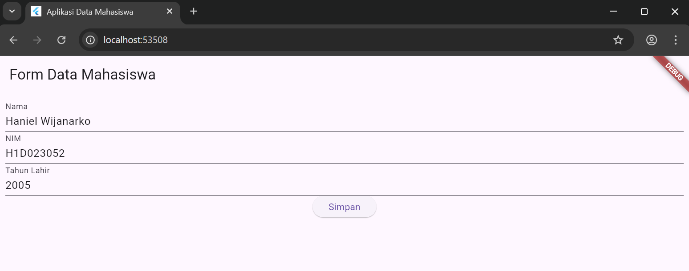

# 🚀 Proses Passing Data dari Form ke Tampilan
Proses ini biasanya terjadi dalam langkah-langkah berikut dalam konteks aplikasi Flutter:

1. Pengumpulan Data (Form)
Pada tampilan "Form Data Mahasiswa", pengguna memasukkan data:

Nama: Haniel Wijanarko
NIM: H1D023052
Tahun Lahir: 2005
Data ini disimpan oleh widget TextField atau TextFormField dan diakses menggunakan TextEditingController atau melalui fungsi onChanged atau onSaved.

2. Pemicuan Pengiriman Data (Tombol Simpan)
Ketika pengguna menekan tombol "Simpan" (Simpan), sebuah event dipicu. Di dalam handler event tombol ini, terjadi beberapa hal:

Data yang telah dikumpulkan (Nama, NIM, Tahun Lahir) diambil nilainya.
Perhitungan Umur: Umur dihitung berdasarkan Tahun Lahir. Karena hasil tampilan menunjukkan umur 20 tahun, diasumsikan perhitungan yang dilakukan adalah: Tahun Saat Ini−Tahun Lahir=Umur.
Tahun Saat Ini−2005=20
(Ini mengindikasikan bahwa Tahun Saat Ini adalah 2025.)

3. Passing Data (Navigasi & Argument)
Data yang sudah lengkap (Nama, NIM, dan Umur) kemudian diteruskan (passed) ke halaman tampilan hasil melalui proses navigasi. Ini adalah inti dari "passing data" dalam Flutter:
- Navigasi: Aplikasi menggunakan fungsi navigasi seperti Navigator.push() (untuk navigasi biasa) atau Navigator.pushNamed() (untuk named routes).

4. Penerimaan & Penampilan Data (Tampilan Hasil)
Pada tampilan "Data Mahasiswa", terjadi hal berikut:
Penerimaan: Widget TampilanDataMahasiswa menerima data (nama, nim, dan umur) melalui constructor-nya.
Penampilan: Data tersebut kemudian digunakan untuk membangun widget teks akhir yang berbunyi: "Nama saya Haniel Wijanarko, NIM H1D023052, dan umur saya adalah 20 tahun."

Secara keseluruhan, data bergerak dari state Form (input) → Event Simpan (perhitungan umur dan pengemasan data) → Navigasi (passing argument) → State Tampilan (output).

# 📸 Screenshot
## 1. Tampilan Form Data Mahasiswa

Berikut adalah tampilan form untuk menginput data mahasiswa.

## 2. Tampilan Hasil Data Mahasiswa

Berikut adalah tampilan hasil setelah data diinput dan diproses (termasuk perhitungan umur).

